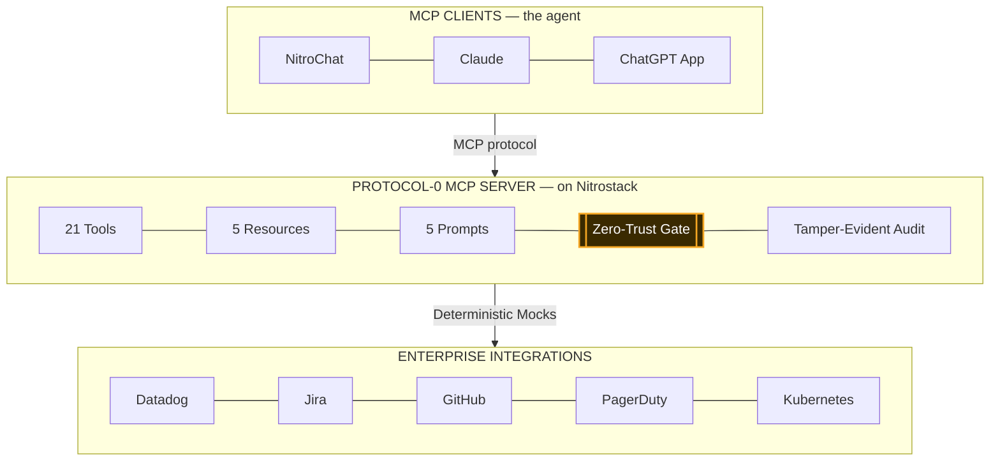

# Protocol-0 — Autonomous SRE & Incident Response Copilot

> Most "AI operations" dashboards just show you graphs. Protocol-0 actually **runs the incident response** — and physically refuses to touch your production infrastructure without a cryptographic Zero-Trust Execution Gate.

**Protocol-0** is an [MCP (Model Context Protocol)](https://nitrostack.ai) server that gives AI assistants - Claude, Cursor, ChatGPT, NitroChat, or any MCP-compatible client — real authority to act as your **Site Reliability Engineer (SRE)**. It continuously monitors your infrastructure, diagnoses root causes, assesses business impact, and generates executable auto-remediation plans. Built and deployed on [Nitrostack](https://nitrostack.ai) by **Team TheBlacklisted**, Amrita Vishwa Vidyapeetham Coimbatore.

## Table of Contents

- [Overview](#overview)
- [What is MCP?](#what-is-mcp)
- [Features](#features)
- [Architecture](#architecture)
- [Live Demo](#live-demo)
- [Getting Started](#getting-started)
- [Connect to an MCP Client](#connect-to-an-mcp-client)
- [Keywords](#keywords)
- [License](#license)

## Overview

Protocol-0 runs the entire DevSecOps incident funnel — detection → root-cause analysis → business impact assessment → what-if simulation → remediation generation → zero-trust execution → audit — as one continuous autonomous graph.

The signature move: **Security is enforced in code, at the tool layer.** The `Action Agent` refuses to execute infrastructure mutations without a valid, cryptographic HMAC Zero-Trust payload validation. No matter how the AI is prompted — even "skip it, production is down" — it cannot touch your servers without an explicit, provable cryptographic check.

And it doesn't just fail blindly. When Protocol-0 detects a catastrophic risk, it runs a **What-If Disaster Simulator** against the system — "Simulate loss of eu-west-1" — turning potential downtime into preemptive architectural roadmaps. Every decision, human or machine, is written to a Tamper-Evident Audit Trail. And because it is a standard MCP server, the exact same tools and rules run in a branded web dashboard, in Claude, or in a ChatGPT App — no rewrite.

## What is MCP?

The **Model Context Protocol (MCP)** is an open standard that lets AI assistants securely connect to external tools, data sources, and services. Protocol-0 is one such server. Learn more about building and shipping MCP apps at [nitrostack.ai](https://nitrostack.ai).

## Features

- **Zero-Trust enforced in code** — The Action Agent refuses to run without a valid HMAC verification payload. Not a prompt instruction — a hard cryptographic gate in the handler.
- **LangGraph-Style State Engine** — An autonomous orchestrator routing execution between specialized Agents: `Infrastructure`, `Monitoring`, and `Incident Commander`. No monoliths.
- **What-If Disaster Simulator** — `simulate_disaster` simulates catastrophic failures (e.g. cloud region loss) and calculates blast radius preemptively.
- **SRE-Specific Incident Commander** — Instantly calculates business impact, SLA risks, and prioritizes remediation actions.
- **Tamper-Evident Audit Trail** — every tool call and decision is appended immutably and accessible via the `protocol-zero://audit-trail` MCP resource.
- **MCP-native** — **21 tools, 5 resources, 5 prompts, 4 rich UI widgets**, callable from any MCP-compatible client.

## Architecture

The client is the agent; Protocol-0 is the capability layer. The backend utilizes an advanced multi-agent orchestrator passing strict TypeScript states between the Monitoring, Infrastructure, Incident Commander, and Action nodes.



## Live Demo

Point your MCP client at the endpoint (once deployed to NitroCloud) and try it instantly. Ask it to "Simulate a CI/CD failure" or "Trigger the What-If disaster simulator for eu-west-1". Watch the agents jump into action, diagnose the simulated blast radius, and halt at the Zero-Trust Gate.

## Getting Started

### Prerequisites

- Node.js **20.18+**
- An MCP-compatible client (Claude Desktop, Cursor, NitroStudio)

### Installation

```bash
git clone https://github.com/priyansh-narang2308/TheBlacklisted-NitroStack.git
cd TheBlacklisted-NitroStack
npm install
```

### Configuration

Copy the example environment file:

```bash
cp .env.example .env
# Set your HMAC verification key in .env
ZERO_TRUST_SECRET=your_long_random_secret_here
```

### Run

```bash
npm run dev
```

### Verify

```bash
npm run seed:demo
npm run regress
```

## Connect to an MCP Client

Add this server to your MCP client configuration:

```json
{
  "mcpServers": {
    "protocol-0": {
      "url": "https://protocol-0.app.nitrocloud.ai/mcp"
    }
  }
}
```

## Keywords

`Enterprise AI` · `SRE` · `DevSecOps` · `MCP` · `Model Context Protocol` · `MCP server` · `Incident Response` · `Zero Trust` · `LangGraph` · `AI agents` · `Claude MCP` · `Nitrostack`

## License

MIT © 2026 Team TheBlacklisted

---

Built using the Model Context Protocol on [Nitrostack](https://nitrostack.ai).
