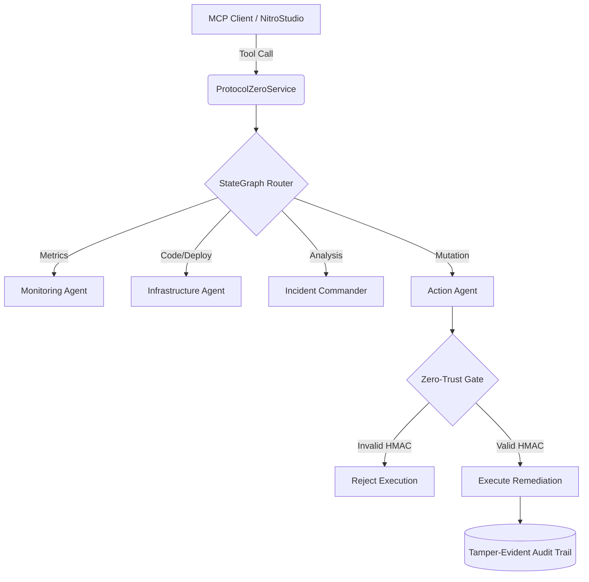
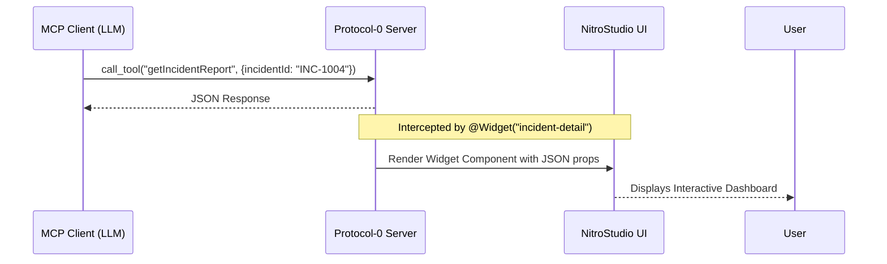

# Protocol-0 Architecture

## 1. System Overview

Protocol-0 operates as a deterministic, multi-agent orchestrated Model Context Protocol (MCP) server built on NitroStack. It bridges the gap between Large Language Models (LLMs) and enterprise infrastructure by providing a secure, strictly-typed capability layer for DevSecOps.

## 2. Core Execution Flow (StateGraph)

The backbone of Protocol-0 is a LangGraph-style state machine that routes execution context deterministically.

## 3. The Zero-Trust Cryptographic Gate

The signature security feature of the architecture is the inline Zero-Trust HMAC Cryptographic Gate.

1. **Payload Generation**: The backend generates a remediation plan with a specific ID.
2. **Execution Request**: The AI Agent attempts to call `approveRecommendation`.
3. **Cryptographic Validation**: The handler computes a SHA-256 HMAC hash of the payload using a server-side secret (`ZERO_TRUST_SECRET`).
4. **Enforcement**: If the provided token does not match the server-computed hash, the execution is blocked with a `ZERO_TRUST_VIOLATION`. This makes prompt-injection or hallucinated mutations mathematically impossible.

## 4. UI Rendering Engine (NitroStack Widgets)

Protocol-0 leverages the NitroStack `@Widget` decorator to transform raw JSON tool responses into interactive frontend components.

